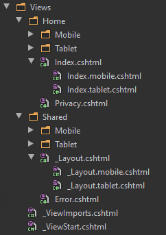
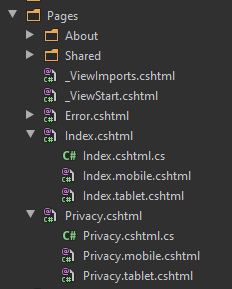

## ASP.NET Core Detection with Responsive View

ASP.NET Core Detection service components for identifying details about client device, browser, engine, platform, & crawler. Responsive middleware for routing base upon request client device detection to specific view. Also in the added feature of user preference made this library even more comprehensive must for developers whom to target multiple devices with view rendered and optimized directly from the server side.

**Please show me some love and click the** :star:


[](https://ci.appveyor.com/project/wangkanai/detection)
[](https://www.nuget.org/packages/wangkanai.detection)
[](https://www.nuget.org/packages/wangkanai.detection)
[](https://www.myget.org/feed/wangkanai/package/nuget/wangkanai.detection)

[](https://github.com/wangkanai/Detection/blob/dev/LICENSE)
[](https://opencollective.com/wangkanai)
[](https://www.patreon.com/wangkanai)
 
[](https://ci.appveyor.com/project/wangkanai/detection/history)

This project development has been in the long making of my little spare time. Please show your appreciation and help me provide feedback on you think will improve this library. All developers are welcome to come and improve the code by submit a pull request. We will have constructive good discussion together to the greater good.

- [ASP.NET Core Detection with Responsive View](#aspnet-core-detection-with-responsive-view)
- [Installation](#installation)
- [Detection Service](#detection-service)
  - [Make your web app able to detect what client is accessing](#make-your-web-app-able-to-detect-what-client-is-accessing)
    - [MVC](#mvc)
    - [Razor Pages](#razor-pages)
  - [Detection in Middleware](#detection-in-middleware)
  - [Detection Fundamentals](#detection-fundamentals)
    - [Device Resolver](#device-resolver)
    - [Browser Resolver](#browser-resolver)
    - [Platform Resolver](#platform-resolver)
    - [Engine Resolver](#engine-resolver)
    - [Crawler Resolver](#crawler-resolver)
    - [Detection Options](#detection-options)
- [Responsive Service](#responsive-service)
  - [Responsive MVC](#responsive-mvc)
  - [Responsive Razor Pages](#responsive-razor-pages)
  - [Responsive Tag Helpers](#responsive-tag-helpers)
  - [User Preference](#user-preference)
  - [Responsive Options](#responsive-options)
- [Directory Structure](#directory-structure)
  - [Contributing](#contributing)
- [Contributors](#contributors)
  - [Code Contributors](#code-contributors)
  - [Financial Contributors](#financial-contributors)
    - [Individuals](#individuals)
    - [Organizations](#organizations)

## Installation

Installation of detection library is now done with a single package reference point. If you are using ASP.NET Core 2.X please use [detection version 2.0 installation](https://github.com/wangkanai/Detection/tree/release/2.0).

```powershell
PM> install-package Wangkanai.Detection -pre
```

This library host the component services to resolve the access client device type. To the servoces your web application is done by configuring the `Startup.cs` by adding the detection service in the `ConfigureServices` method.

```c#
public void ConfigureServices(IServiceCollection services)
{
    // Add detection services container and device resolver service.
    services.AddDetection();

    // Needed by Wangkanai Detection
    services.AddSession(options =>
    {
        options.IdleTimeout = TimeSpan.FromSeconds(10);
        options.Cookie.HttpOnly = true;
        options.Cookie.IsEssential = true;
    });

    // Add framework services.
    services.AddControllersWithViews();
}
```

* `AddDetection()` Adds the detection services to the services container.

The current device on a request is set in the Responsive middleware. The Responsive middleware is enabled in the `Configure` method of `Startup.cs` file. [Make sure that you have app.UseDetection() before app.UseRouting](https://github.com/wangkanai/Detection/issues/355).

```c#
public void Configure(IApplicationBuilder app, IHostingEnvironment env)
{
    app.UseDetection();
    
    app.UseRouting();

    app.UseSession();

    app.UseEndpoints(endpoints => endpoints.MapDefaultControllerRoute());
}
```

Adding the TagHelper features to your web application with following in your `_ViewImports.cshtml`

```razor
@using WebApplication1

@addTagHelper *, Microsoft.AspNetCore.Mvc.TagHelpers
@addTagHelper *, Wangkanai.Detection
```

## Detection Service

After you have added the basic of the detection services, let us learn how to utilized the library in your web application. In which we have got the help from [dependency injection](https://docs.microsoft.com/en-us/aspnet/core/fundamentals/dependency-injection) to access all functionality of `IDetectionService` has to offer.

### Make your web app able to detect what client is accessing

Detection service support usage in both Model-View-Controller (MVC) and Razor Pages.

#### MVC

Here is how you would use the library in `Controller` of a [MVC pattern](https://docs.microsoft.com/en-us/aspnet/core/tutorials/first-mvc-app/) by injecting the detection service into the constructor of the controller. 

```c#
public class AboutController : Controller
{
    private readonly IDetectionService _detectionService;

    public AboutController(IDetectionService detectionService)
    {
        _detectionService = detectionService;
    }

    public IActionResult Index()
    {
        return View(_detectionService);
    }
}
```

#### Razor Pages

For [razor pages](https://docs.microsoft.com/en-us/aspnet/core/tutorials/razor-pages/) web application that only have the pages without `PageModel` behind, you can access the detection service via the `@inject` tag after the `@page` in your _.cshtml_ files. Here would be the example below;

```razor
@page
@inject Wangkanai.Detection.Services.IDetectionService DetectionService
@{
    ViewData["Title"] = "Detection";
}
<ul>
    <li>@DetectionService.Device.Type</li>
    <li>@DetectionService.Browser.Name</li>
    <li>@DetectionService.Platform.Name</li>
    <li>@DetectionService.Engine.Name</li>
    <li>@DetectionService.Crawler.Name</li>
</ul>
```

What if you razor pages use the code behind model, you can still inject the detection service into it via the constructor just similar way as MVC controller does it.

```c#
public class IndexModel : PageModel
{
    private readonly IDetectionService _detectionService;

    public IndexModel(IDetectionService detectionService)
    {
        _detectionService = detectionService;
    }
    
    public void OnGet()
    {
        var device = _detectionService.Device.Type;
    }
}
```

### Detection in Middleware

Would you think that [Middleware](https://docs.microsoft.com/en-us/aspnet/core/fundamentals/middleware/) can also use this detection service. Actually it can! and our [Responsive](#responsive-service) make good use of it too. Let us learn how that you would use detection service in your custom middleware which we would use the [Per-request middleware dependencies](https://docs.microsoft.com/en-us/aspnet/core/fundamentals/middleware/write#per-request-middleware-dependencies). But why would we use pre-request injection for our middleware you may ask? Easy! because every user is unique. Technically answer would be that `IDetectionService` by using `TryAddTransient<TInterface, TClass>` where you can [learn more about transient](https://docs.microsoft.com/en-us/aspnet/core/fundamentals/dependency-injection#transient). If you inject `IDetectionServices` into the middleware constructor, then the service would become a singleton. Meaning to subject to application not per client request.

So now we know about the basic lets look at the code:

```c#
public class MyCustomMiddleware
{
    private readonly RequestDelegate _next;

    public MyCustomMiddleware(RequestDelegate next)
    {
        _next = next ?? throw new ArgumentNullException(nameof(next));
    }

    public async Task InvokeAsync(HttpContext context, IDetectionService detection)
    {
        if(detection.Device.Type == Device.Mobile)
            context.Response.WriteAsync("You are Mobile!");

        await _next(context);
    }
}
```

### Detection Fundamentals

Detection services would extract information about the visitor web client by parsing the [user agent](https://developer.mozilla.org/en-US/docs/Web/HTTP/Headers/User-Agent) that the web browser gives to the web server on every http/https request. We would make the assumption that every requester is using common Mozilla syntax: _Mozilla/[version] ([system and browser information]) [platform] ([platform details]) [extensions]_. If detection service can not identify the information, it will we have give you `Unknown` enum flag. There are total of 5 resolver services the our detection services.

#### Device Resolver

This would be the basic resolver that you might be thinking using to identify what kind client `Device` is access your web app, which include Desktop, Tablet, and Mobile for the basic stuff. While we can also use to identify is the device a Watch, Tv, Game Console, Car, and Internet of Things.

```c#
var isMobile = detectionService.Device.Type == Device.Mobile;
```

#### Browser Resolver

Moving the stack we get what `Browser` is the client using to access your web app. We only include the common web browser detection starting from Chrome, Internet Explorer, Safari, Firefox, Edge, and Opera. For the rest we would mark them as others or unknown (aka Crawler).

```c#
var isIE = detectionService.Browser.Name == Browser.InternetExplorer;
```

#### Platform Resolver

Now we can also identify what `Platform` is the client using to access your web app starting in [version 3.0](https://github.com/wangkanai/Detection/milestone/13). We got Windows, Mac, iOS, Linux, and Android.

```c#
var isMac = detectionService.Platform.Name == Platform.Mac;
```

#### Engine Resolver

Now we can also identify what `Engine` is the client using to access your web app starting in [version 3.0](https://github.com/wangkanai/Detection/milestone/13). We got WebKit, Blink, Gecko, Trident, EdgeHTML, and Servo.

```c#
var isTrident = detectionService.Engine.Name == Engine.Trident;
```

#### Crawler Resolver

This would be something that web analytics to keep track on how are web crawler are access your website for indexing. We got starting everybody favorite that is Google, Bing, Yahoo, Baidu, Facebook, Twitter, LinkedIn, WhatsApp, and Skype.

```c#
var isGoogle = detectionService.Crawler.Name == Crawler.Google;
```

#### Detection Options

There are basic options that you can add to detection services. Like to adding something that detection does not identify by default to the `Others` list.

```c#
public void ConfigureServices(IServiceCollection services)
{
    // Add responsive services.
    services.AddDetection(options =>
    {
        options.Crawler.Others.Add("goodbot");
    });

    // Add framework services.
    services.AddControllersWithViews();
}
```

## Responsive Service

This is where thing get more interesting that is built upon detection service, or matter a fact detection service was built because of responsive service. The concept is that we would like to have views that correspond to what kind of device to accessing to our web app. 

### Responsive MVC

Responsive Views for MVC has 2 format for you to utilize. First is would be to most common is `Suffix` and the secord format is `SubFolder`. Lets make this follow example a `suffix` as of my opinionated would be the most common way to managed all the views. This `suffix` format is done by add device type before the file extension **_.cshtml_** like **_.mobile.cshtml_**. Below is how you would structure your Views folder. 



### Responsive Razor Pages

Responsive for razor pages newly added in [wangkanai.detection 3.0](https://github.com/wangkanai/Detection/pull/297). This enable completed responsive in asp.net core ecosystem. Same like Views in MVC we have `suffix` format where we add the device type in before the file extension **_.cshtml_** like **_.mobile.cshtml_**.



### Responsive Tag Helpers

The next exciting feature add in [wangkanai.detection 3.0](https://github.com/wangkanai/Detection/pull/301) is Tag Helpers. This make you able to use the same view and just show/hide specific part of the views to the client base upon their type, this include Device, Browser, Platform, Engine, and Crawler that our detection resolver could determine from the resolver parsing services.

```razor
<device include="mobile">is mobile</device>
<device exclude="mobile">not mobile</device>
```

```razor
<browser include="chrome">is chrome</browser>
<browser exclude="chrome">not chrome</browser>
```

```razor
<platform include="windows">is windows</platform>
<platform exclude="windows">not windows</platform>
```

```razor
<engine include="blink">is blink</engine>
<engine exclude="blink">not blink</engine>
```

```razor
<crawler include="google">is google</crawler>
<crawler exclude="google">not google</crawler>
```

### User Preference

When a client visit your web application by using a mobile device and you have responsive view for mobile device. But the visitor would like to view the web app with a desktop view, their click this link to change their preference to desktop view.

```razor
<a href="/Detection/Preference/Prefer">
    <div class="alert alert-light" role="alert">
        Desktop version
    </div>
</a>
```

If the client selected to view in desktop view, he/she can switch back mobile view by the follow example;

```razor
<preference only="mobile">
    <a href="/Detection/Preference/Clear">
        <div class="alert alert-light" role="alert">
            Switch to mobile version
        </div>
    </a>
</preference>
```

### Responsive Options

You can customize the default behaviour of how responsive service would react to client request. You can go in deep by examining `ResponsiveOptions`.

```c#
public void ConfigureServices(IServiceCollection services)
{
    // Add responsive services.
    services.AddDetection(options =>
    {
        options.Responsive.DefaultTablet  = Device.Desktop;
        options.Responsive.DefaultMobile  = Device.Mobile;
        options.Responsive.DefaultDesktop = Device.Desktop;
        options.Responsive.IncludeWebApi  = false;
        options.Responsive.Disable        = false;
        options.Responsive.WebApiPath     = "/Api";
    });

    // Add framework services.
    services.AddControllersWithViews();
}
```

* `AddDetection(Action<DetectionOptions> options)` Adds the detection services to the services container.

## Directory Structure

* `src` - The source code of this project lives here
* `test` - The test code of this project lives here
* `collection` - Collection of sample user agents for lab testing
* `sample` - Contains sample web application of usage
* `doc` - Contains the documentation on how utilized this library

### Contributing

All contribution are welcome, please contact the author.

## Contributors

### Code Contributors

This project exists thanks to all the people who contribute. [[Contribute](CONTRIBUTING.md)].
<a href="https://github.com/wangkanai/Detection/graphs/contributors"></a>

### Financial Contributors

Become a financial contributor and help us sustain our community. [[Contribute](https://opencollective.com/wangkanai/contribute)]

#### Individuals

[](https://opencollective.com/wangkanai)

#### Organizations

Support this project with your organization. Your logo will show up here with a link to your website. 
[[Contribute](https://opencollective.com/wangkanai/contribute)]

<a href="https://opencollective.com/wangkanai/organization/0/website"></a>
<a href="https://opencollective.com/wangkanai/organization/1/website"></a>
<a href="https://opencollective.com/wangkanai/organization/2/website"></a>
<a href="https://opencollective.com/wangkanai/organization/3/website"></a>
<a href="https://opencollective.com/wangkanai/organization/4/website"></a>
<a href="https://opencollective.com/wangkanai/organization/5/website"></a>
<a href="https://opencollective.com/wangkanai/organization/6/website"></a>
<a href="https://opencollective.com/wangkanai/organization/7/website"></a>
<a href="https://opencollective.com/wangkanai/organization/8/website"></a>
<a href="https://opencollective.com/wangkanai/organization/9/website"></a>
